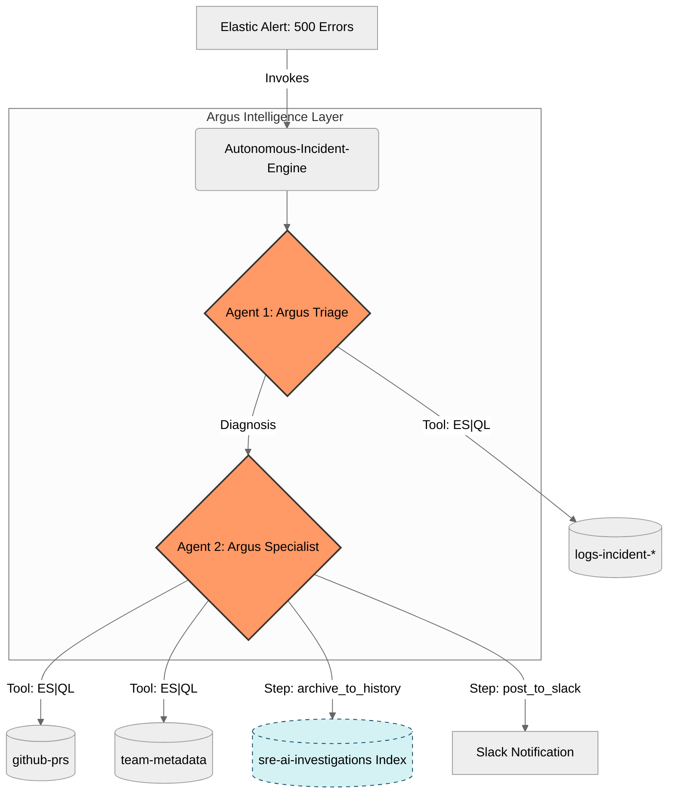

# Argus SRE: Autonomous Incident Engine

# 🏗 Architecture Diagram

Argus SRE utilizes a Multi-Agent Reasoning pipeline within an Elastic Agentic Workflow. This design ensures that log analysis is separated from high-level correlation logic, maximizing accuracy and reducing hallucinations.



# 📝 Project Overview

The Problem: SRE teams suffer from "Alert Fatigue." When a service fails, engineers must manually hunt through logs and cross-reference GitHub deployments to find the "why." This context-switching increases MTTR (Mean Time To Recovery).

The Solution: Argus SRE is an autonomous, event-driven engine built natively on Elastic Workflows. It transforms raw alerts into actionable Root Cause Analysis (RCA) reports by correlating system logs with GitHub metadata in real-time.

# 🤖 Multi-Agent Logic

The engine utilizes a two-step reasoning process to ensure high-fidelity results:

Agent 1: Argus Triage: Parses the incoming alert and queries logs-incident-* using ES|QL to identify the specific error signature (e.g., Database Connection Timeout).

Agent 2: Argus Specialist: Takes the diagnosis from Agent 1 and uses specialized tools to fetch recent GitHub PRs and Team Metadata. It performs temporal reasoning to match code changes against the failure symptoms.

# ✨ Key Features

Deterministic Reasoning: Uses ES|QL pipes for precise data retrieval instead of fuzzy semantic-only searches.

Logical Chaining: The output of the Triage agent acts as the context for the Specialist agent, creating a robust "Chain of Thought."

Automated Persistence: Every investigation is archived to the sre-ai-investigations index, building a persistent knowledge base of AI-resolved incidents.

# 📂 Repository Structure

<details>
<summary>Click to expand folder tree</summary>
```text
argus-sre/
├── LICENSE                    # MIT License
├── README.md                  # Project documentation & architecture
├── requirements.txt           # Python dependencies
├── log_ingestor.py            # Python script for ingesting sample logs
├── argus-sre-workflow.yaml    # Exported Elastic Workflow (Redacted)
├── alert_config.md            # Details of the 500-error Alert trigger
├── setup_indices.md           # PUT/POST commands for the 4 indices
├── queries.md                 # Documentation of ES|QL queries used
└── prompts/                   # Logic layer for the Multi-Agent system
    ├── triage_analysis.md     # Instructions for Agent 1 (Triage)
    └── specialist_deep_dive.md # Instructions for Agent 2 (Specialist)
```
</details>
    
# 🛠 Technical Setup

Dependencies: Install requirements via pip install -r requirements.txt.

Workflows: Import the argus-sre-workflow.yaml file into your Elastic Project.

Data Layer: Execute the mapping commands in setup_indices.md via the Dev Tools Console to initialize the PRs and Metadata indices.

Log Ingestion: Run python log_ingestor.py to populate the indices with sample incident logs and GitHub pull request data.

Alerting: Configure a Custom Threshold Alert in Elastic Observability as defined in alert_config.md.

Agent Tools: Ensure the agents are connected to the ES|QL tools defined in queries.md.

# ⚙️ Configuration (Action Required)

To protect sensitive information, certain fields are marked as [REDACTED]. Before running:

Workflows: Open the workflow in the Elastic UI and update the Slack Block with your actual Connector ID and Channel ID.

Scripts: Update log_ingestor.py with your Elastic ENDPOINT_URL and API_KEY.

Permissions: Ensure your Elastic API Key has write access to the indices defined in setup_indices.md.

⚖️ License

This project is licensed under the MIT License.
